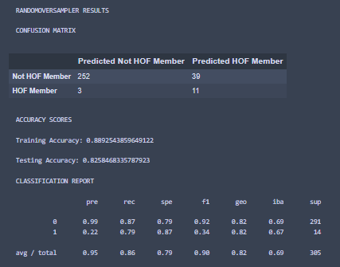
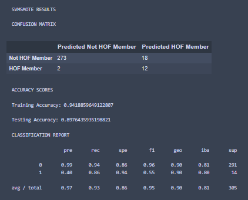
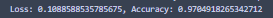
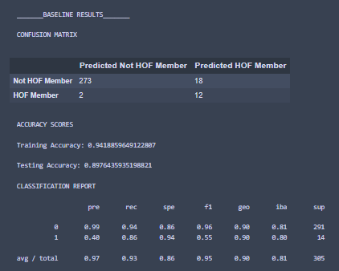
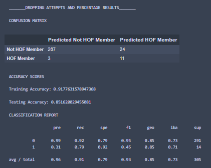
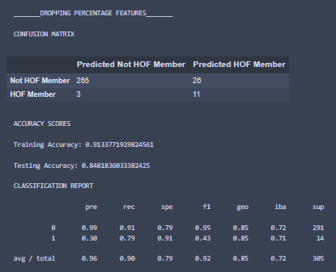
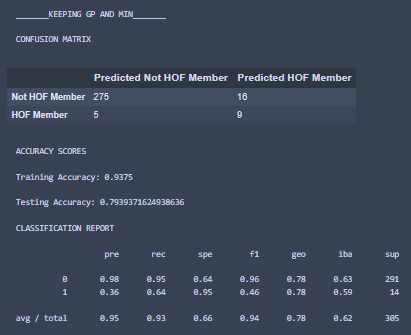
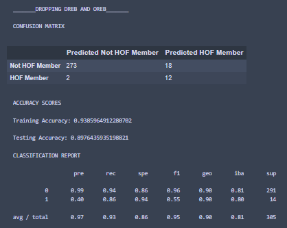

# NBA Hall of Fame Predictions

## Selected topic
Predicting if an National Basketball Association (NBA) player will be inducted into the Hall of Fame based only on their rookie year statistics.

## Reason why topic was selected
After brainstorming we found that everyone in the group had an interest in sports. We knew there would be an abundance of data for professional sports leagues and decided to choose a topic involving the NBA. We initially were interested to see if there was any correlation between a player’s induction into the Hall of Fame and their rookie year statistics.

## Outline

- Overview
    - Brainstormed topics
    - Found common interest in sports
    - Chose topic - NBA HAll of Fame predictions based on players rookie year statistics
    
- Preprocessing
    - Inspected data
    - Replaced strings representing zeros with integer 0
    - Converted hyphens using the pandas '.to_numeric()' function
    - Filled in NaNs
    - Used pandas '.get_dummies()' function to separate Hall of Fame class columns into "Inducted" and "Not Inducted"
    
- Database
    - SQL
    - Pandas
    - PgAdmin
    - AWS

- Machine Learning
    - Supervised classification machine learning model was used (scikit-learn logistic regression method for our data fitting)
    - RandomOverSampler
    - SMOTE
    - SVM SMOTE

- Visualizations
    - Tableau dashboard
    - Interactive charts
    - Easy to read graphs that higlight every player from 1980 to 2008
    - Tableau stories
   
- View our [Google Slides presentation here](https://docs.google.com/presentation/d/1KHQcw8sbCei26WB8A8FRXLCDnFFpWTpy9OIAjOntWtc/edit?usp=sharing).

- View our Data files in the [DataPreperation folder]( https://github.com/Kelcon86/NBA_HOF_Predictions/tree/main/DataPreparation) or find it above.

- View our Database files in the [DB_Documentation folder](https://github.com/Kelcon86/NBA_HOF_Predictions/tree/main/DB_Documentation) or find it above.

- View our machine learning files in the [machine_learning folder]( https://github.com/Kelcon86/NBA_HOF_Predictions/tree/main/machine_learning) or find it above.

## Data Source Description
We found several datasets that contained data for this topic, but ultimately chose to use NBA Rookies by Year_Hall of Fame Class.xlsx found on [data.world]( https://data.world/gmoney/nba-rookies-by-min-1980-2016). This file was then converted into a csv (nba_hof_rookies.csv).


## Questions we hope to answer with the data
- Can we accurately predict an NBA players induction into the Hall of Fame based on their statistics from their rookie season
- Was there a correlation between rookie year statistics and length of career for players inducted into the Hall of Fame?

## Description of the communication protocols
Our group has communicated through a dedicated Slack channel as well as via Zoom.

## Data Exploration Phase
- Description of preliminary data preprocessing

    *   There were a few irregularities upon first inspection of the data. The first step was replacing any strings representing zeros with the actual integer 0. For example, there were a few number of instances in the `3P%` column withihn the NBA_HOF_Rookies.csv file where, rather than a 0, a hyphen was entered. This resulted in the column being labeled as an `object` rather than a `float64` using the pandas `.dtypes`. This column would cause errors within our machine learning process. The hyphens were converted using the pandas `.to_numeric()` function with this code:

        ```rookies_df['3P%'] = rookies_df['3P%'].replace({'-':'0'})```

    *   The next step was filling in any NaNs. The majority of NaNs were found in the `Hall of Fame Class` and `Pick` columns since if a player had not been inducted or drafted, they would not have a number those cells. This was addressed by replacing and filling in these with the labels "Hall of Fame Member" and "Not Inducted" for the Hall of Fame column and adding a 0 to the Pick column for each respective player.

    *   Lastly, using the pandas `.get_dummies()` function our `Hall of Fame Class` column was encoded to separate the "inducted" and "not_inducted" players into separate columns since the "inducted" column will be our target for our machine learning model.  

To see specificlly how all of our datasets were cleaned and prepared for merging please refer to the [DataPreparation folder](https://github.com/Kelcon86/NBA_HOF_Predictions/tree/main/DataPreparation/DataCleaningNotebooks) in the repository.

To see all SQL statements and our Database ERD (image also below) please refer to the [DB_Documentation folder](https://github.com/Kelcon86/NBA_HOF_Predictions/tree/main/DB_Documentation) in the repository.


## Machine Learning 

### Analysis Phase
- Description of preliminary feature engineering and preliminary feature selection, including the decision-making process

    *   Feature selection for this project was very straight forward, as most of the feature were related to in-game statistics like points, shots made, shot attempts, turnovers, etc. These features were all kept as removing them had a negative impact on our machine learning model (see optimization table below). There were several non-performance related features like number of games played, average minutes played per game, and draft year, etc. These features were dropped since they did not directly relate to a player’s performance and would likely not help with the machine learning model.
    *   
- Description of how data was split into training and testing sets

    *   The data was shuffled and split into the training and test sets using the default parameters, which is `train_size = 0.25` and `test_size = 0.75` per [the sklearn documentation](https://scikit-learn.org/stable/modules/generated/sklearn.model_selection.train_test_split.html).

- Explanation of model choice, including limitations and benefits

### Machine Learning Models Table

This table shows each type of machine learning model that we used and their results, our best performing model and the one we selected to use was Logistic Regression using the SVM SMOTE over sampler. Oversampling was needed due to the highly imbalanced nature of our dataset. This model had both the highest training accuracy and lowest number of false positives. 


| **Model**           | **Oversampler**   | **Results** |
|---------------------|-------------------|-------------|
| Logistic Regression | RandomOverSampler |  |
| Logistic Regression | SMOTE             |  |
| Logistic Regression | SVM SMOTE         |  |
| Basic Neural Net    | n/a               |  |
| Deep Learning       | n/a               |  |

To see the file used to run all these models, please refer to the [ml_model_experiments.ipynb file](https://github.com/Kelcon86/NBA_HOF_Predictions/blob/main/machine_learning/ml_model_experiments.ipynb) in the [machine_learning folder](https://github.com/Kelcon86/NBA_HOF_Predictions/tree/main/machine_learning) in our repository.

### Optimization Attempts Table

This table shows the number of different optimization attempts made pertaining to feature selection. Each attempt experimented with dropping and keeping combinations of features to help the machine learning model perform better overall. Per the results seen in the table, our baseline feature selection (keeping all performance stats) resulted in the best outcome.

|                    **Dropped Features**                    |                 **Results**                |                                                             **Reason**                                                             |
|:----------------------------------------------------------:|:------------------------------------------:|:----------------------------------------------------------------------------------------------------------------------------------:|
|           Baseline: All Performance Features Kept.          |  |                                                                 n/a                                                                |
| Keeping Shots Made Only. Drop: FGA, FG%, 3PA, 3P%, FTA, FT%. |         |      Shots made, attempts, and percentage are all related to one another.  Keeping only shots made could help improve resutls.     |
|     Keeping Shots Made and Attempts. Drop: FG%, 3P%, FT%.     |         |          Since keeping only shots made did not help improve results,  only dropping percentage to see if results improve.          |
|             Added Back 'GP' and 'MIN' Features.             |         | These features were dropped originally because they were not performance stats.  Adding these back to see if they improve results. |
|           Keeping Total Rebounds Drop: OREB, DREB.          |         |                        REB is the sum of OREB and DREB,  since we have the REB feature they may not be needed.                        |

To see the file used to run all these optimization attempts, please refer to the [ml_model_optimizations.ipynb](https://github.com/Kelcon86/NBA_HOF_Predictions/blob/main/machine_learning/ml_model_optimizations.ipynb) in the [machine_learning folder](https://github.com/Kelcon86/NBA_HOF_Predictions/tree/main/machine_learning) in our repository.

#### Benefits and Limitations

*   The largest limitation of our dataset is that it is highly imbalanced. The basketball Hall of Fame, which has existed since the inaugural class of 1959, has only, at most, **178** players. Our dataset, which has data going as far back as the draft class of 1980, has less than 40 Hall of Fame players out of the over 1200 players in the dataset. Because of this, we ran several imbalanced-learn oversampling methods. Please refer to the **Machine Learning Models Table** above to see the results.

*   Our model choice (Logistic Regression with SVM SMOTE oversampling) has one limitation that was shown in the results above in the Machine Learning Table. There were two Hall of Fame players that were misidentified as not Hall of Fame players (false negatives) where the SMOTE model only had one such player. In a dataset as imbalanced as our even just one player misidentified can have a significant impact. However, due to the much lower number of false positives from the SVM SMOTE model compared to the others, the SVM SMOTE oversamplers still came out as the best model.

*   One of the benefits of our data is that it includes classifications, the "Hall of Fame Class" column, so we can use a supervised classification machine learning model. Specifically, we are using the **scikit-learn logistic regression** method for our data fitting. In addition, we are using the solver `liblinear` rather than the default solver since according to [holypython.com](https://holypython.com/log-reg/logistic-regression-optimization-parameters/) it is a more efficient solver with smaller and imbalanced datasets.

## Database
Using a combination of SQL, Pandas, Pgadmin and AWS multiple files were loaded, joined, and used as input to the analysis and modeling process. 


## Dashboard
Using Tableau we are able create a story that helps visualize our project using several charts and interactive elements. 

One of our interactive elements is a moveable quadrant graph that highlights every player's Points Per Game(PPG) And Minutes Played(MP) in their rookie season.
   

   
Another interactive element involves an Efficiency (EFF) line graph that highlights every player from 1980 to 2008 which can be filter between players that are and are not in the Hall of Fame.


