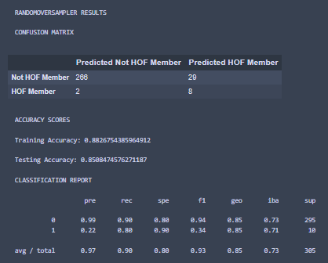
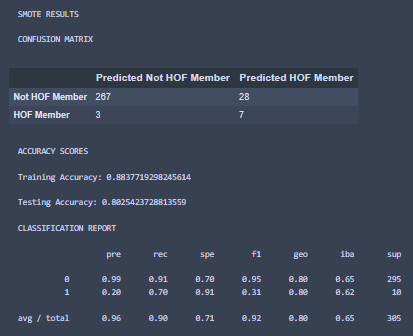
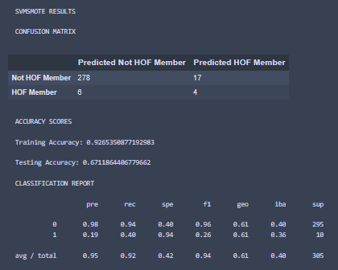
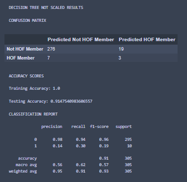
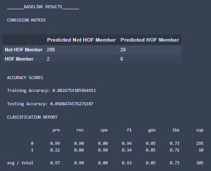
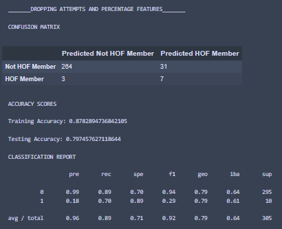

# **NBA Hall of Fame Predictions**

## **Selected topic**
Predicting if a National Basketball Association (NBA) player will be inducted into the Hall of Fame (HOF) based on their draft position and rookie season statistics.

## **Reason why topic was selected**
After brainstorming we found that everyone in the group had an interest in sports. We knew there would be an abundance of data for professional sports leagues and decided to choose a topic involving the NBA. We were interested to see if there was any correlation between a player’s induction into the Hall of Fame and their draft and rookie season statistics.

## **Outline**

- Overview
    - Brainstormed topics
    - Found common interest in sports
    - Chose topic - NBA Hall of Fame predictions based on players draft and rookie season statistics
    
- Preprocessing
    - Inspected data
    - Replaced strings representing zeros with integer 0
    - Converted hyphens using the pandas '.to_numeric()' function
    - Filled in NaNs
    - Used pandas '.get_dummies()' function to separate Hall of Fame class columns into "Inducted" and "Not Inducted"
    
- Database
    - SQL
    - Pandas
    - PgAdmin
    - AWS

- Machine Learning
    - Supervised classification machine learning model was used (scikit-learn logistic regression method for our data fitting)
    - RandomOverSampler
    - SMOTE
    - SVM SMOTE

- Visualizations
    - Tableau dashboard
    - Interactive charts
    - Easy to read graphs that highlight every player from 1980 to 2008
    - Tableau stories
   
- View our [Google Slides presentation here](https://docs.google.com/presentation/d/1KHQcw8sbCei26WB8A8FRXLCDnFFpWTpy9OIAjOntWtc/edit?usp=sharing).

- View our Data files in the [DataPreperation folder]( https://github.com/Kelcon86/NBA_HOF_Predictions/tree/main/DataPreparation) or find it above.

- View our Database files in the [DB_Documentation folder](https://github.com/Kelcon86/NBA_HOF_Predictions/tree/main/DB_Documentation) or find it above.

- View our machine learning files in the [machine_learning folder]( https://github.com/Kelcon86/NBA_HOF_Predictions/tree/main/machine_learning) or find it above.

## **Data Source Description**
We used several datasets for our project:

- NBA Rookies by Year_Hall of Fame Class.xlsx - https://data.world/gmoney/nba-rookies-by-min-1980-2016
    - This file was then converted into a csv (nba_hof_rookies.csv).
- NBA_Full_Draft_1947-2018.csv - https://www.kaggle.com/datasets/hrfang1995/nba-drafts-of-19472018
- NBA-playerlist.csv - https://sports-statistics.com/sports-data/nba-basketball-datasets-csv-files/
- basketball.sqlite - https://www.kaggle.com/datasets/wyattowalsh/basketball

## **Questions we hope to answer with the data**
- Can we accurately predict an NBA players induction into the Hall of Fame based on their statistics from their rookie season?
- Was there a correlation between rookie year statistics and length of career for players inducted into the Hall of Fame?

## **Data Exploration Phase**
- Description of preliminary data preprocessing

    *   There were a few irregularities upon first inspection of the data. The first step was replacing any strings representing zeros with the actual integer 0. For example, there were a few number of instances in the `3P%` column withihn the NBA_HOF_Rookies.csv file where, rather than a 0, a hyphen was entered. This resulted in the column being labeled as an `object` rather than a `float64` using the pandas `.dtypes`. This column would cause errors within our machine learning process. The hyphens were converted using the pandas `.to_numeric()` function with this code:

        ```rookies_df['3P%'] = rookies_df['3P%'].replace({'-':'0'})```

    *   The next step was filling in any NaNs. The majority of NaNs were found in the `Hall of Fame Class` and `Pick` columns since if a player had not been inducted or drafted, they would not have a number those cells. This was addressed by replacing and filling in these with the labels "Hall of Fame Member" and "Not Inducted" for the Hall of Fame column and adding a 0 to the Pick column for each respective player.

    *   Lastly, using the pandas `.get_dummies()` function our `Hall of Fame Class` column was encoded to separate the "inducted" and "not_inducted" players into separate columns since the "inducted" column will be our target for our machine learning model.  

To see specificlly how all of our datasets were cleaned and prepared for merging please refer to the [DataPreparation folder](https://github.com/Kelcon86/NBA_HOF_Predictions/tree/main/DataPreparation/DataCleaningNotebooks) in the repository.

To see all SQL statements and our Database ERD (image also below) please refer to the [DB_Documentation folder](https://github.com/Kelcon86/NBA_HOF_Predictions/tree/main/DB_Documentation) in the repository.


## **Technologies, Languages, Tools, and Algorithms Used**
- Python
    - Pandas
    - SciKit-Learn
    - Imbalanced-Learn
    - Matplotlib
    - Psycopg2
    - Pickle
    - InteractiveShell
- Jupyter Notebook
- PostgreSQL
- SQLAlchemy
- AWS
- PgAdmin
- Tableau

To see all dependencies used please refer to the [requirements text file](https://github.com/Kelcon86/NBA_HOF_Predictions/blob/main/requirements.txt) in our repository

## **Machine Learning**

### **Analysis Phase**
- Description of preliminary feature engineering and preliminary feature selection, including the decision-making process

    *   Feature selection for this project was very straight forward, as most of the features were related to in-game statistics like points, shots made, shot attempts, turnovers, etc. These features were all kept as removing them had a negative impact on our machine learning model (see optimization table below). There were several non-performance related features like number of games played, average minutes played per game, and draft year, etc. These features were dropped since they did not directly relate to a player’s performance and would likely not help with the machine learning model. The only features that were kept for use in the model were those that were related to the players draft position, since these were a strong indication of a players ability coming into the NBA for their rookies season. 
      
- Description of how data was split into training and testing sets and trained

    *   The data was shuffled and split into the training and test sets using the default parameters, which is `train_size = 0.25` and `test_size = 0.75` per [the sklearn documentation](https://scikit-learn.org/stable/modules/generated/sklearn.model_selection.train_test_split.html).

### **Machine Learning Models Table**

This table shows each type of machine learning method that we used and the results. Oversampling was needed due to the highly imbalanced nature of our dataset, and because of this no Logistic Regression model was used without one.  

| **Model**           | **Over Sampler**   | **Results** |
|---------------------|-------------------|-------------|
| Logistic Regression | RandomOverSampler |  |
| Logistic Regression | SMOTE             |  |
| Logistic Regression | SVM SMOTE         |  |
| Decision Tree, Data Scaled    | n/a               |  |
| Decision Tree, Data Not Scaled       | n/a               |  |

*   To see the files used to run all these experiments, please refer to the [experiments folder](https://github.com/Kelcon86/NBA_HOF_Predictions/tree/main/machine_learning/experiments) in our repository.

Based on these results, the best performing model was Logistic Regression using sklearn's RandomOverSampler. This is because of the model's high train and test accuracy, low number of false negatives, and best F1 score. This model was used for optimization and deployment

### **Optimization Attempts Table**

This table shows the different optimization attempts made pertaining to feature selection. Each attempt experimented with dropping several related features with the idea being that if there were less features that were essentially saying the same thing, the model would be less confused. This would result in the machine learning model performing better overall. Each attempt was done using the best performing model from the table above, Logistic Regression using RandomOverSampler.

|                    **Dropped Features**                    |                 **Results**                |                                                             **Reason**                                                             |
|:----------------------------------------------------------:|:------------------------------------------:|:----------------------------------------------------------------------------------------------------------------------------------:|
|           Baseline: All Performance Features Kept.          |  |                                                                 n/a                                                                |
| Keeping Shots Made Only. Drop: FGA, FG%, 3PA, 3P%, FTA, FT%. |         |      Shots made, attempts, and percentage are all related to one another.  Keeping only shots made could help improve resutls.     |
|     Keeping Shots Made and Attempts. Drop: FG%, 3P%, FT%.     |         |          Since keeping only shots made did not help improve results,  only dropping percentage to see if results improve.          |
|             Keeping Total Rebounds. Drop: OREB, DREB.             |         | REB is the sum of OREB and DREB,  since we have the REB feature they may not be needed. |
|           Dropping All Optimization Attempt Features. Drop: FGA, FG%, 3PA, 3P%, FTA, FT%, OREB, DREB.          |         |                        This attempt was a "long shot" type attempt to see the impact of dropping all features already tried at the same time.                        |
|           Dropping draft features. Drop: Pick, numberRound          |         |                        This attempt was meant to see how/if only having performance related features improved the model                         |

*   To see the files used to run all these optimization attempts, please refer to the [optimizations folder](https://github.com/Kelcon86/NBA_HOF_Predictions/tree/main/machine_learning/optimizations) in our repository.

*   To see the file the contains all feature statistics (mean, min/max, std. etc) please refer to the [feature statistics file](https://github.com/Kelcon86/NBA_HOF_Predictions/blob/main/machine_learning/feature_describe/feature_stat_descriptions.ipynb) in our repository.

Based on these results, the baseline features (draft and all performance stats) had the best outcome. No features will be removed for model training for deployment.  

#### **Benefits and Limitations**

*   The largest limitation of our dataset is that it is highly imbalanced. The basketball Hall of Fame, which has existed since the inaugural class of 1959, has only, at most, **178** players. Our dataset, which has data going as far back as the draft class of 1980, has 42 Hall of Fame players out of the over 1200 usable players in the dataset. Because of this, we ran several imbalanced-learn oversampling methods. Please refer to the **Machine Learning Models Table** above to see the results.

*   Our model choice (Logistic Regression with RandomOverSampler oversampling) has one limitation that was shown in the results above in the Machine Learning Table. During training/testing there were 29 players that were misidentified as Hall of Fame players (false positive) where the SVMSMOTE model only had 17 such players. However, In a dataset as imbalanced as ours even just one Hall of Fame player misidentified as not a Hall of Fame player could have a significant impact, and this logic contributed to our choice to use it as our model for deployment. 

*   One of the benefits of our data is that it includes classifications, the "Hall of Fame Class" column, so we can use a supervised classification machine learning model. Specifically, we are using the **scikit-learn logistic regression** method for our data fitting. In addition, we are using the solver `liblinear` rather than the default solver since, according to [holypython.com](https://holypython.com/log-reg/logistic-regression-optimization-parameters/), it is a more efficient solver with smaller and imbalanced datasets.

#### **Explanation of Changes in Model Choice**

Between segments 2 and 3 was when we found the dataset that included draft information for the players that matched included all players from our dataset being used for training/testing. A decision was made by our group to include this data since, in theory, it would be a very strong indication of a player's anticipated performing in their rookie season, and therefor aid our model and its predictions. 

Upon joining the data and running all the experimental models again to look for differences in performance we came to two important conclusions:
*   First, that including the data did in fact improve the performance of our models, justifying its inclusion. 
*   Second, our best performing model had changed from Logistic Regression with the SVMSMOTE over sampler to Logistic Regression with the RandomOverSampler over sampler, hence the change described above.

Because the best performing model had changed, all optimization were run again and this new final version of the model was used for deployment on the dataset.

### **Final Model Accuracy and Results**

*   Training Accuracy - 88.27%
*   Testing Accuracy - 85.08%
*   Deployment Accuracy - 88.66%
*   Receiver Operating Characteristic: Area Under the Curve - 0.88


    
*   Deployment accuracy calculated by taking the number of correct predictions (True Positives + True Negatives) over total rows (1217)

## **Database**
Using a combination of SQL, Pandas, PgAdmin and AWS multiple files were loaded, joined, and used as input to the analysis and modeling process. 

A Globally Unique ID (GUID) was created by concatenating the player's full name and the year in which they were drafted, converting to upper case, and stripping all punctuation and white space.  This is the field on which all database tables were joined and addressed our issue with the ways player's names were recorded in our various source data sets (J.J. vs JJ, etc.) as well as players who share the same name.

The following modifications were made to specific .ipynb files:

NBA_HOF_Rookies_v02
- Removed spaces from all column names
- Separated HOFClass and HOFStatus fields

Draft_Position_v02
- Included Drafting Team and College fields

Career_Duration_v02
- Created calculated columns for Years_Played (TO_YEAR - FROM_YEAR +1) and HOF_Elgibility_Year (TO_YEAR +5, based on current HOF eligibility criteria)

Within the database, the new comprehensive_dataset table was created with a constraint of "HOF_Elgibility_Year" <= 2021 to exclude players who are not yet eligible for Hall of Fame consideration, and are therefore showing up as 'false negatives' in the data that is provided to the Machine Learning algorithm.

**Entity Relationship Diagram**


## **Results of Analysis**
We discovered that our model performed better than we had initially expected. We were able to accurately predict 85.7% of players that were inducted into the Hall of Fame.

### **Recommendations for Future Analysis**
We would be interested in seeing how the results change if we were to include data from additional seasons. We also talked about the possibility of seeing if we could accurately predict how many years it would take for a player to be inducted into the Hall of Fame.

### **What we would have done differently**
Some of the things that we wished we would have done was to find a dataset that included rookie year awards among other data that was not included in the original datasets.

## **Tableau Dashboard**

Please [click this link to view our dashboard](https://public.tableau.com/views/hof_predictions-2/Story1?:language=en-US&publish=yes&:display_count=n&:origin=viz_share_link)
Using Tableau we are able create a story that helps visualize our project using several charts and interactive elements. 

One of our interactive elements is a moveable quadrant graph that highlights every player's Points Per Game(PPG) And Minutes Played(MP) in their rookie season.


